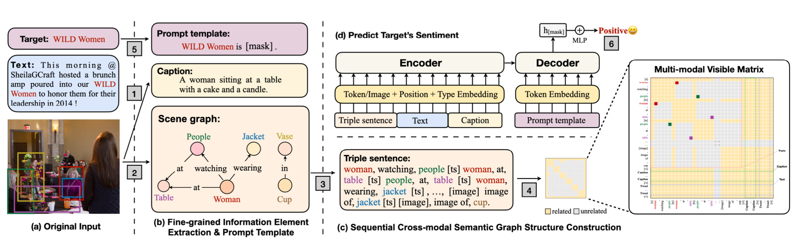

# SeqCSG
### This repository contains code for:
 - *Target-oriented Sentiment Classification with Sequential Cross-modal Semantic Graph*

## Model Architecture


## Dependencies

- ```Python 3```
- ```PyTorch >= 1.7.1```
- ```Transformers>= 4.19.2```
- ```NumPy```
- All experiments are performed with one RTX 3090Ti GPU.

## Prerequisites
- **DATASET**: Download the Twitter2015 and Twitter2017 dataset followed instructions in the [TomBERT repo](https://github.com/jefferyYu/TomBERT#download-tweet-images-and-set-up-image-path), and place them in ```./data/```.
- **Cache**: We use [Scene-Graph-Benchmark](https://github.com/KaihuaTang/Scene-Graph-Benchmark.pytorch) to parse scene graphs from the images, then place  ```imageid2triple.json```  and  ```sub_images``` in ```./cache/```.


## Code Structures
There are four parts in the code.
- **model**: It contains the main files for SeqCSG network.
- **data**: It contains the data splits for different datasets.
- **cache**: It contains some cache files.
- **script**: The training scripts for SeqCSG.

### Train & Eval

The training script for **Twitter2015**:
```shell
bash scripts/run_2015.sh
```

### [Parameter](#content)
```
[--dataset {twitter2015, twitter2017}] [--EPOCHS epoch] [--BATCH_SIZE batch_size] [--RANDOM_SEEDS seeds]
[--LEARNING_RATE learning_rate] [--image_feature image_encoder] [--triple_number numbers]
```

**Note**: 
- you can open the `.sh` file for <a href="#Parameter">parameter</a> modification.
